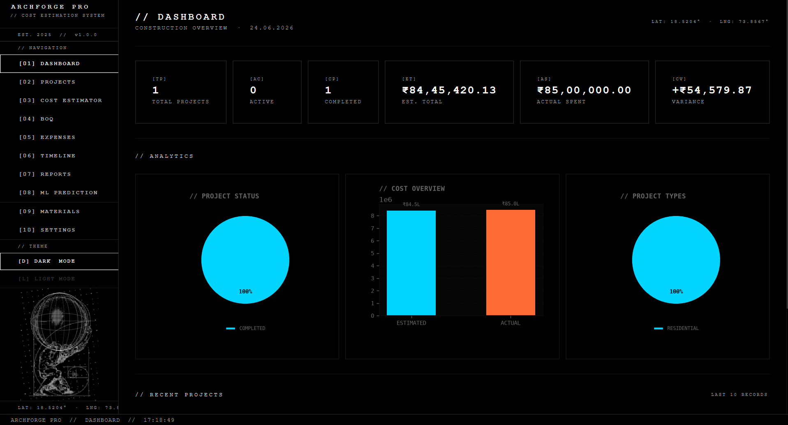
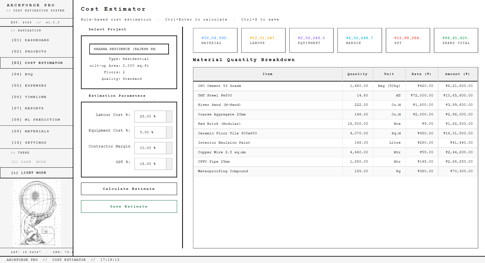
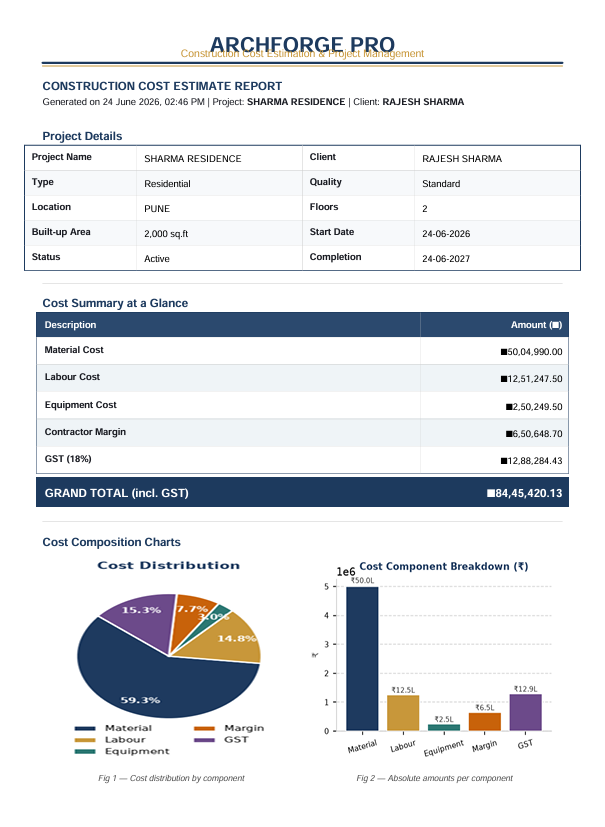
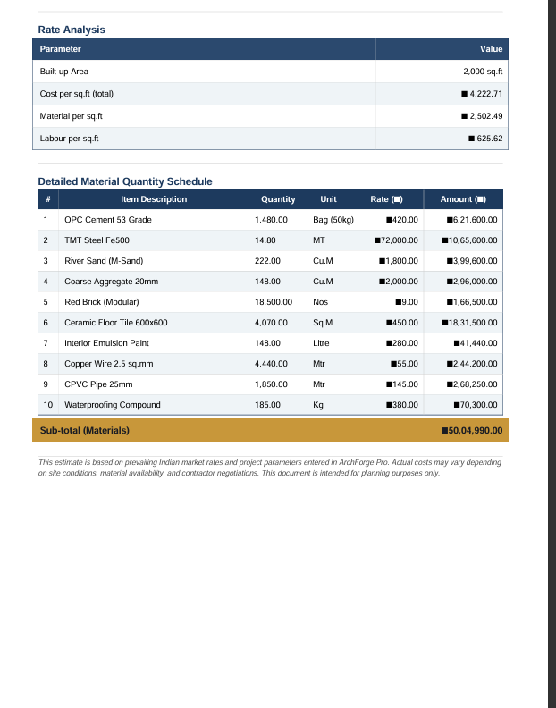
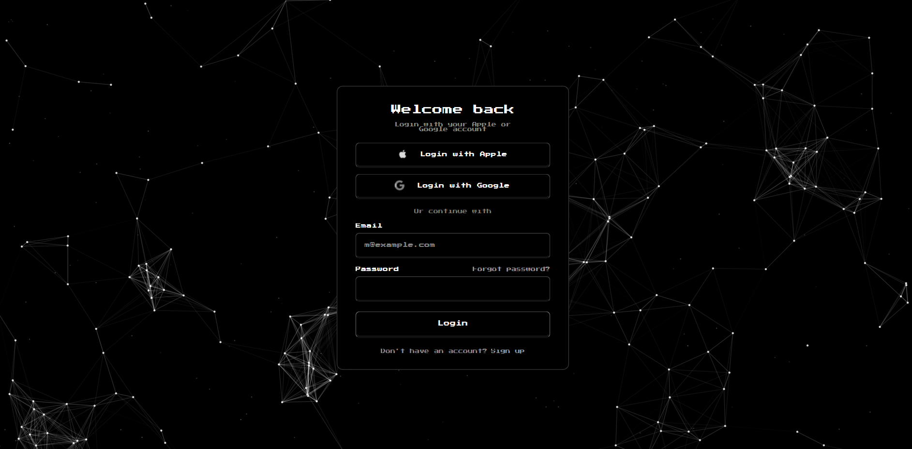
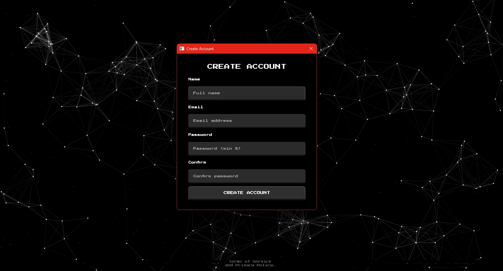
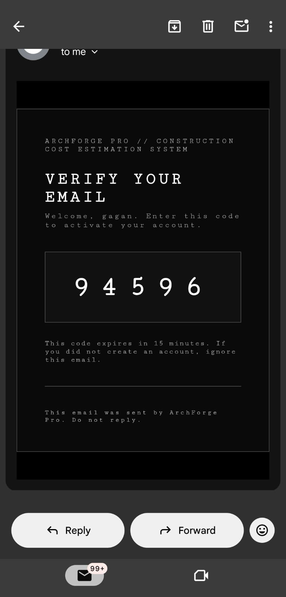

<div align="center">


# ArchForge Pro

**Construction Cost Estimation Platform for the Indian Market**

[](https://python.org)
[](https://riverbankcomputing.com/software/pyqt/)
[](https://sqlite.org)
[](LICENSE)
[](https://github.com/XenQ-Dev/ArchForge-Pro/releases)

<br/>

> *Drop the project specs. Define the scope. Run the estimator. Generate the BOQ.*
> *Track real expenses. Let the ML engine cross-check. Send the professional report.*

<br/>

[**⬇ Download**](https://github.com/XenQ-Dev/ArchForge-Pro/releases) • [**Features**](#features) • [**Getting Started**](#getting-started) • [**Build the EXE**](#build-the-exe)

</div>

---

## What is ArchForge Pro?

ArchForge Pro is a **fully offline** Windows desktop application for Indian construction professionals. It handles the entire estimation workflow — from project intake to branded PDF report delivery — without requiring any internet connection, cloud subscription, or external API.


---

## Features

| | Feature | Description |
|---|---|---|
| 🔐 | **Secure Accounts** | Email + password login with PBKDF2-SHA256 hashed passwords (260k iterations) and per-user data isolation |
| 📧 | **Email Verification** | 5-digit OTP emailed via Gmail SMTP on sign-up; forgot-password reset by emailed code |
| 💾 | **Persistent Sessions** | Stay signed in across app restarts until you explicitly sign out |
| 🏗️ | **Rule-based Estimator** | Applies Indian Standard rates by quality tier (Economy → Luxury), computes material quantities, labour, equipment, GST in one pass |
| 🤖 | **ML Cost Prediction** | XGBoost model trained on Indian project data — independent cost check with confidence range |
| 📋 | **BOQ Generator** | Full Bill of Quantities from a saved estimate, exportable to PDF and Excel |
| 💸 | **Expense Tracker** | Log actuals with category and receipt ref, variance computed against estimate in real time |
| 📅 | **Phase Timeline** | Nine standard construction phases with planned/actual dates, completion %, and Gantt chart |
| 📊 | **5 PDF Reports** | Cost Estimate, BOQ, Expense, Variance Analysis, Project Summary — all with embedded charts |
| 🧱 | **Materials Database** | Rate catalogue by category and supplier |
| 🌓 | **Dark / Light Theme** | Brutalist terminal aesthetic, fully theme-aware charts and UI |
| ⌨️ | **Keyboard Shortcuts** | Ctrl+N, Ctrl+F, Ctrl+S, Ctrl+Enter, double-click to edit — built for speed |
| 📦 | **Fully Offline** | SQLite, local ML inference, no cloud, no subscriptions |

---

## Screenshots

<div align="center">

**Dark Mode — Dashboard**


<br/>

**Light Mode — Cost Estimator**


<br/>

**PDF Report — Cost Summary & Charts**


<br/>

**PDF Report — Material Schedule & Rate Analysis**


<br/>

**Sign In — Pixel UI with Interactive Constellation Background**


<br/>

**Sign Up — Create Account**


<br/>

**Email Verification — 5-digit OTP**



</div>

---

## Authentication & Accounts

ArchForge Pro is multi-user. Every project, estimate, BOQ, expense, and timeline is tied to the account that created it — users only ever see their own data.

### Sign-in flow

```
App launch ──► Login screen ──► Dashboard
                   │
                   ├─ Sign up ──► Email verification (5-digit OTP) ──► Dashboard
                   └─ Forgot password ──► Emailed reset code ──► New password
```

- **Login** — email + password. Passwords are stored as PBKDF2-SHA256 hashes (260,000 iterations, per-user random salt) — never in plain text.
- **Sign up** — creates an account, then requires a **5-digit verification code** sent to the email address before the account is activated.
- **Forgot password** — sends a reset code to the registered email; enter the code and a new password to reset.
- **Persistent sessions** — once signed in you stay signed in, even after closing and reopening the app, until you click **Sign Out** (top-right of the dashboard). Sessions are token-based and stored locally.

### Email Verification Setup (Gmail SMTP)

Verification and reset codes are delivered over **Gmail SMTP**. Configure it once under **Settings → Email / SMTP**:

1. Enable **2-Step Verification** on your Google account
2. Create an **App Password** at [myaccount.google.com/apppasswords](https://myaccount.google.com/apppasswords) (choose "Mail")
3. In ArchForge Pro: **Settings → Email / SMTP** → enter your Gmail address and the 16-character App Password
4. Click **Send Test Email** — on success the settings are saved automatically

> **Dev mode:** if no SMTP credentials are configured, the app runs in development mode and shows the verification code on-screen instead of emailing it — so you can test the full flow without a mail server.

Credentials are stored in the local SQLite database (gitignored) and are never committed or sent anywhere except Gmail's SMTP server.

---

## Getting Started

### Option A — Download the EXE *(recommended)*

1. Go to [**Releases**](https://github.com/XenQ-Dev/ArchForge-Pro/releases)
2. Download `ArchForgePro_v1.0.0.zip`
3. Extract the zip anywhere
4. Run `ArchForgePro.exe`

No Python needed. No installation. Just extract and run.

---

### Option B — Run from source

**Requirements:** Python 3.11+

```bash
git clone https://github.com/XenQ-Dev/ArchForge-Pro.git
cd ArchForge-Pro
python -m venv .venv
.venv\Scripts\activate
pip install -r requirements.txt
python main.py
```

---

## Build the EXE

Want to build the executable yourself? Follow these steps.

### Step 1 — Install dependencies

```powershell
python -m venv .venv
.venv\Scripts\activate
pip install -r requirements.txt
pip install pyinstaller
```

### Step 2 — Run the build script

```powershell
build.bat
```

This runs PyInstaller and produces the app inside:

```
dist\
  ArchForgePro\
    ArchForgePro.exe   ← your executable
    ...                ← all bundled resources
```

### Step 3 — Zip and share

```powershell
Compress-Archive -Path "dist\ArchForgePro" -DestinationPath "ArchForgePro_v1.0.0.zip"
```

Share the zip file — anyone can extract it and run `ArchForgePro.exe` without installing Python.

### Optional — Create a Windows Installer

1. Install [Inno Setup 6](https://jrsoftware.org/isinfo.php)
2. Open `installer.iss` in Inno Setup
3. Press **Compile** (Ctrl+F9)
4. A single `ArchForgePro_Setup.exe` installer is produced in the `Output\` folder

---

## Keyboard Shortcuts

| Shortcut | Action |
|---|---|
| `Ctrl + N` | New project |
| `Ctrl + F` | Focus search |
| `Ctrl + Enter` | Calculate estimate |
| `Ctrl + S` | Save estimate |
| `Double-click` | Edit project row |
| `Delete` | Delete selected project |
| `Escape` | Clear search |

---

## Tech Stack

| Layer | Technology |
|---|---|
| UI | PyQt6 |
| Auth | PBKDF2-SHA256 password hashing, token sessions |
| Email | Gmail SMTP (`smtplib` + STARTTLS) |
| Database | SQLite — WAL mode, indexed foreign keys |
| Charts (UI) | Matplotlib — theme-aware, vivid palette |
| Charts (PDF) | Matplotlib → PNG → ReportLab |
| PDF Reports | ReportLab |
| Excel Export | openpyxl |
| ML Model | Scikit-learn, XGBoost |
| Packaging | PyInstaller (`--onedir --windowed`) |
| Installer | Inno Setup 6 |
| Language | Python 3.11 |

---

## Project Structure

```
ArchForge-Pro/
├── app/
│   ├── controllers/        # Estimation engine, BOQ, report generation
│   ├── models/             # SQLite models (users, sessions, projects, estimates...)
│   ├── views/
│   │   ├── auth/           # Login, registration, verification, password reset
│   │   ├── pages/          # Dashboard, Estimator, BOQ, Expenses, Timeline...
│   │   └── dialogs/        # Project, expense, material dialogs
│   ├── ml/                 # XGBoost predictor + trainer
│   ├── utils/              # Node-field bg, email sender, fonts, brand icons, paths
│   └── resources/
│       ├── styles/         # dark_theme.qss, light_theme.qss
│       ├── fonts/          # Press Start 2P (pixel font, OFL)
│       └── images/         # App icon, atlas image
├── config.example.py       # SMTP config template (copy to config.py — gitignored)
├── main.py                 # Entry point + splash + auth routing
├── build.bat               # PyInstaller build script
├── installer.iss           # Inno Setup installer config
└── requirements.txt
```

---

## Reports Preview

Each PDF report includes embedded charts generated by Matplotlib:

| Report | What's inside |
|---|---|
| **Cost Estimate** | KPI summary + Pie + Bar chart + Rate per sq.ft + Material schedule |
| **BOQ** | Category pie + bar + full itemised BOQ table |
| **Expense Report** | Category pie + Monthly trend line + Itemised ledger |
| **Variance Analysis** | Budget utilisation donut + Budget vs actual bar + Component breakdown |
| **Project Summary** | Cost pie + Budget tracker + Phase table + Gantt chart |

---

<div align="center">

Built for Indian construction professionals · Offline · No subscriptions · No cloud

**Copyright © 2026 Gagan Naik**

</div>
